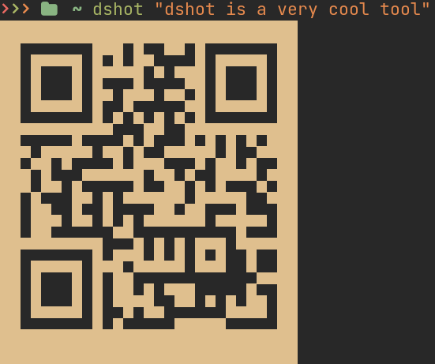
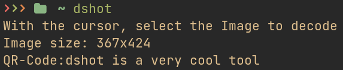

# DShot

Inspired in: 

Decode EAN/UPC, DataBar, Code 128/93/39, Codebar, QRCode, SQCode, or encode a String into QRCode on terminal. Linux Only

# Usage
## Encode
```sh
dshot "<text-to-qrcode>"
```


## Decode 

Run `dshot` on terminal, and select the encoded area in screen. 



# Dependencies

### DON'T WORK IN WAYLAND!

- zbarimg - Decode into text 
- qrencode - Encode string to text
